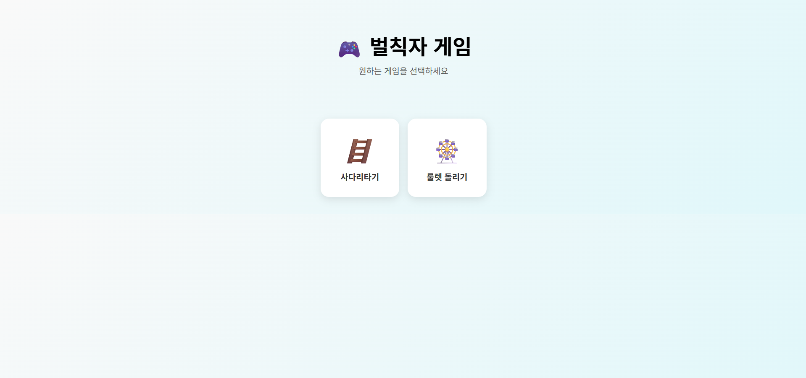

# 벌칙자 게임

벌칙자를 정하는 간단한 웹 기반 게임입니다. (사다리타기, 룰렛 돌리기)

## 🛠 사용한 기술
- HTML
- CSS
- JavaScript

## 🚀 실행방법

설명란에 있는 주소(GitHub Pages 링크)를 눌러서 실행하거나, 
이 저장소를 다운로드 받은 후 `index.html` 파일을 브라우저에서 열면 바로 실행됩니다.

## 📸 스크린샷

---

# Penalty Game

A simple web-based game to decide a penalty. (Includes Ladder Game and Roulette)

## 🛠 Tech Stack
- HTML
- CSS
- JavaScript

## 🚀 How to Run

You can run it immediately by clicking the link in the description (GitHub Pages),
or by downloading this repository and opening the `index.html` file in your browser.

## 📸 Screenshot

